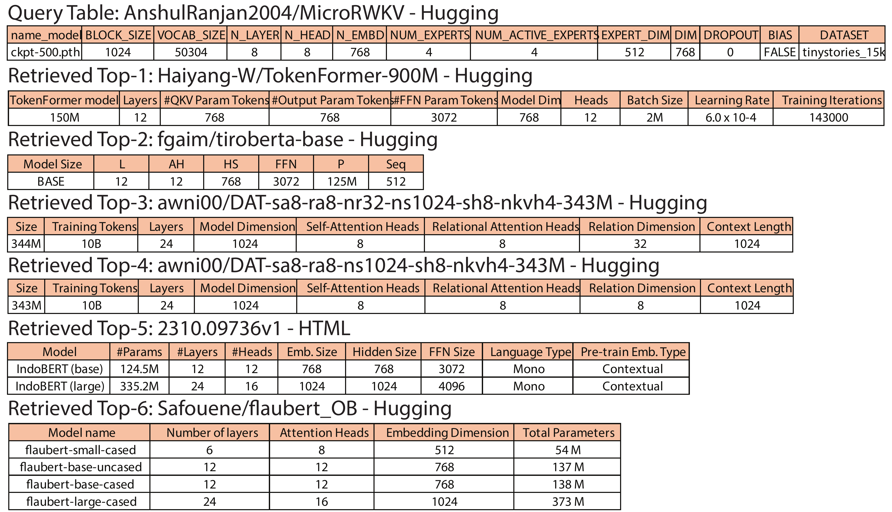
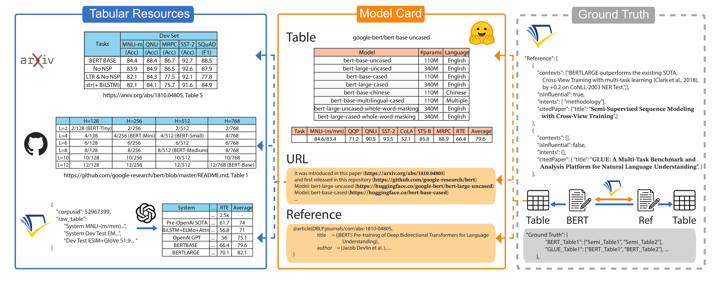

# 📚 Semantic Table Discovery in Model Lakes:  a Benchmark

<p align="center">
  <a href="YOUR_ARXIV_LINK" target="_blank"></a>
  <a href="YOUR_GITHUB_REPO_LINK" target="_blank"></a>
  <a href="YOUR_PROJECT_PAGE_LINK" target="_blank"></a>
  <a href="YOUR_HF_DATASET_LINK" target="_blank"></a>
  <a href="YOUR_HF_DAILY_PAPERS_LINK" target="_blank"></a>
  <a href="YOUR_HF_CHROME_PLUGIN_LINK" target="_blank"></a>
  <a href="YOUR_ARXIV_CHROME_PLUGIN_LINK" target="_blank"></a>
  <a href="YOUR_GITHUB_CHROME_PLUGIN_LINK" target="_blank"></a>
</p>

## Motivation

<table style="width:100%;">
  <tr>
    <td style="width:40%; text-align:center; vertical-align:top;">
      Insight Vision
    </td>
    <td style="width:60%; text-align:center; vertical-align:top;">
      Insight Description
    </td>
  </tr>
  <tr>
    <td style="width:40%; text-align:center; vertical-align:middle;">
      
    </td>
    <td style="width:60%; text-align:center; vertical-align:middle;">
      CitationLake is a benchmark framework that bridges traditional Data Lake table discovery techniques with Model Lake challenges by leveraging citation graphs and semantic table search to enable efficient discovery and comparison of pre-trained machine learning models based on their performance and configuration data.
    </td>
  </tr>
</table>

## Example

In our Model Lake benchmark, we apply a Semantic Unionable Search strategy to retrieve semantically compatible tables from a large table lake given a query table. The retrieved tables are unionable, meaning they share similar schema and semantics and can be meaningfully aligned for comparison.


Example 1 (Performance Tables): Starting from a query table that reports BERT’s performance on GLUE and SQuAD, the system retrieves other model performance tables such as RoBERTa, BART, ELECTRA, and Uni-Perceive. These retrieved tables enable direct semantic comparison of models across the same benchmark tasks, highlighting the unionable nature of their content structure.



Example 2 (Configuration Tables): Given a configuration table for a specific model (e.g., MicroRWKV), the system retrieves model spec tables like TokenFormer, TiroBERTa, DAT variants, IndoBERT, and Flaubert. These retrieved tables capture model setup and training hyperparameters, enabling semantic comparison across model architectures.

Together, these examples demonstrate that our method retrieves semantically aligned, task-relevant, and unionable tables that support both performance benchmarking and model configuration analysis under shared topics and structures.

## Overview

CitationLake provides a comprehensive framework for collecting, processing, and enabling semantic search over model-related tabular data. Our pipeline leverages diverse sources like Hugging Face Model Cards, GitHub repositories, and academic papers to construct a rich, interconnected benchmark.

The project focuses on:

  * **Robust Data Ingestion:** Extracting performance metrics and configuration settings from heterogeneous sources.
  * **Citation Graph Construction:** Building multi-level citation graphs (paper, model card, dataset) to infer relationships between models and their associated tables.
  * **Semantic Table Discovery:** This repository primarily handles the preparation of data for semantic table discovery and subsequent analysis; the training and inference for the table discovery technique itself are conducted in the offical starmie GitHub repository: [megagonlabs/starmie](https://github.com/megagonlabs/starmie) or a refined version [DoraDong-2023/starmie_internal](https://github.com/DoraDong-2023/starmie_internal)



In our crawling pipeline, we parse tables from different resources and hyperlinks in each model card. Each model card may contain structured data in various locations. We extract these tables and then label table pairs with ground-truth relationships.

## 📋 Table of Contents
- [Motivation](#motivation)
- [Example](#example)
- [Overview](#overview)
- [Installation](#installation)
- [Scripts](#scripts)
- [Acknowledgements](#acknowledgements)
- [Citation](#citation)

-----

## Installation

Install and setup the environment:

```bash
git clone https://github.com/DoraDong-2023/CitationLake
cd CitationLake
pip install -r requirements.txt
```

Set environment variables:

This project uses the `python-dotenv` library to manage environment variables. Please create a `.env` file in the root directory to store sensitive information such as your OpenAI API key and Semantic Scholar API key. These variables will be automatically loaded using `load_dotenv()`.

```bash
echo "OPENAI_API_KEY='your_api_key'" > .env
echo "SEMANTIC_SCHOLAR_API_KEY='your_api_key'" >> .env # Optional, but recommended for faster Semantic Scholar data downloading and querying
```

## ⬇️ Download Data

This project utilizes datasets hosted on Hugging Face and Semantic Scholar. Use the following commands to download the necessary data:

```bash
mkdir data
mkdir data/processed
# Downloading our tables from https://drive.google.com/drive/folders/1xHbcv01VQ2RG8zmxo0w6y4kRtqxZoAO0?usp=drive_link
pip install gdown
gdown --folder 1xHbcv01VQ2RG8zmxo0w6y4kRtqxZoAO0 -O data/processed/
```
```bash
# Downloading Hugging Face model card datasets if you need to start from scratch
mkdir data/raw
git lfs install
git clone https://huggingface.co/datasets/librarian-bots/model_cards_with_metadata data/raw/model_cards_with_metadata
git clone https://huggingface.co/datasets/librarian-bots/dataset_cards_with_metadata data/raw/dataset_cards_with_metadata

# Downloading Semantic Scholar data if you need to setup local database
# Alternatively, refer to Semantic Scholar API documentation for bulk data access.
```

-----

## Scripts

This section outlines the workflow for processing data, building the ground truth, and running evaluations.

### 1\. Parse Initial Elements

This step extracts key metadata from model cards and associated links.

```bash
# Here I -> Input, O -> Output | skip writing data/processed prefix for brevity

# Split readme and tags, parse URLs, parse BibTeX entries.
# Output: ['modelId', 'author', 'last_modified', 'downloads', 'likes', 'library_name', 'tags', 'pipeline_tag', 'createdAt', 'card', 'card_tags', 'card_readme', 'pdf_link', 'github_link', 'all_links', 'extracted_bibtex', 'extracted_bibtex_tuple', 'parsed_bibtex_tuple_list', 'successful_parse_count']
python -m src.data_preprocess.step1

# Download GitHub READMEs and HTMLs from extracted URLs.
# Input: modelcard_step1.parquet
# Output: giturl_info.parquet, downloaded_github_readmes/
python -m src.data_preprocess.step1_down_giturl

# (Optional) If download is interrupted but some files are present, re-run to save final parquet and cache files.
# python -m src.data_preprocess.step1_down_giturl_fake

# Check sizes of downloaded README files (some might be too large)
find data/downloaded_github_readmes -type f -exec stat -f "%z %N" {} + | sort -nr | head -n 50 | awk '{printf "%.2f MB %s\n", $1/1024/1024, $2}'

# Query specific GitHub URL content (example)
# Input: local path to a downloaded README
# Output: URL content
python -m src.data_preprocess.step1_query_giturl load --query data/downloaded_github_readmes/7166b2cb378b3740c3b212bc0657dd11.md
```

### 2\. Download and Build Database for Faster Querying

This step sets up local databases for efficient querying of Semantic Scholar data.

```bash
# TODO: Add command from privatecommonscript for downloading Semantic Scholar dataset (e.g., se_s2orc_250218)

# Requirement: Navigate to the downloaded dataset directory, e.g., cd ~/shared_data/se_s2orc_250218
# Build database from Semantic Scholar dataset.
python -m src.data_localindexing.build_mini_s2orc build --directory /u4/z6dong/shared_data/se_s2orc_250218/

# Query a paper title from the built database (example)
python -m src.data_localindexing.build_mini_s2orc query --title "BioMANIA: Simplifying bioinformatics data analysis through conversation" --directory /u4/z6dong/shared_data/se_s2orc_250218/

# Query by Semantic Scholar Corpus ID (example)
python -m src.data_localindexing.build_mini_s2orc query_cid --corpusid 248779963 --directory /u4/z6dong/shared_data/se_s2orc_250218

# Issue: Storing citation edges directly can be memory-intensive. Consider querying API for relationships or using graph databases.
# (Optional) Use Kuzu database for nodes and edges (currently slow for large files)
# python -m src.data_localindexing.build_mini_citation_kuzu --mode build --directory /u4/z6dong/shared_data/se_citations_250218/
# python -m src.data_localindexing.test_node_edge_db

# (Optional) Use Neo4j database for nodes and edges (Requires Neo4j setup)
# python src.data_localindexing.build_mini_citation_neo4j --mode build --directory ./ --fields minimal
# python src.data_localindexing.build_mini_citation_neo4j --mode query --citationid 248811336
# For Slurm, to keep Neo4j open in another terminal: sbatch src.data_localindexing.neo4j_slurm

# Fuzzy matching for S2ORC using Elasticsearch
# Build Elasticsearch index
python -m src.data_localindexing.build_mini_s2orc_es --mode build --directory /u4/z6dong/shared_data/se_s2orc_250218 --index_name papers_index --db_file /u4/z6dong/shared_data/se_s2orc_250218/paper_index_mini.db
# Query Elasticsearch index
python -m src.data_localindexing.build_mini_s2orc_es --mode query --directory /u4/z6dong/shared_data/se_s2orc_250218 --index_name papers_index --query "BioMANIA: Simplifying bioinformatics data analysis through conversation"
# Test Elasticsearch index
python -m src.data_localindexing.build_mini_s2orc_es --mode test --directory /u4/z6dong/shared_data/se_s2orc_250218 --index_name papers_index --db_file /u4/z6dong/shared_data/se_s2orc_250218/paper_index_mini.db

# Batch querying papers_index using Elasticsearch
python build_mini_s2orc_es.py --mode batch_query --directory /u4/z6dong/shared_data/se_s2orc_250218 --index_name papers_index --titles_file data/processed/modelcard_dedup_titles.json --cache_file data/processed/query_cache.json

# Getting full tables (ensure previous steps have populated necessary data)
```

### 3\. Extract Tables to Local Folder

This step extracts tabular data from various sources and processes it.

```bash
# Extract tables from GitHub READMEs and Model Cards. Saves CSVs to local folder.
# Input: data/processed/modelcard_step1.parquet, github_readmes_info.parquet, downloaded_github_readmes/
# Output: modelcard_step2.parquet, deduped_hugging_csvs/, hugging_deduped_mapping.json, deduped_github_csvs/, md_to_csv_mapping.json
python -m src.data_preprocess.step2_gitcard_tab

# Process downloaded GitHub HTML files to Markdown.
# Input: data/downloaded_github_readmes/
# Output: data/downloaded_github_readmes_processed/
python -m src.data_preprocess.step2_md2text

# Fetch titles from BibTeX entries and PDF URLs using Semantic Scholar.
# Input: modelcard_step1.parquet, github_readme_cache.parquet, github_readmes_processed/, PDF/GitHub URLs
# Output: modelcard_all_title_list.parquet, github_readme_cache_update.parquet, github_extraction_cache.json, all_links_with_category.csv
python -m src.data_preprocess.step2_se_url_title

# Save deduplicated titles for querying Semantic Scholar.
# Input: modelcard_all_title_list.parquet
# Output: modelcard_dedup_titles.json, modelcard_title_query_results.json, modelcard_all_title_list_mapped.parquet
python -m src.data_preprocess.step2_se_url_save

# Query Semantic Scholar API for citation information (alternative to local database if no key, but may hit rate limits).
# Input: modelcard_dedup_titles.json
# Output: s2orc_query_results.parquet, s2orc_citations_cache.parquet, s2orc_references_cache.parquet, s2orc_titles2ids.parquet
python -m src.data_preprocess.s2orc_API_query > logs/s2orc_API_query_v3_429.log

# Handle API rate limit errors (if any)
# python -m src.data_preprocess.s2orc_log_429
# python -m src.data_preprocess.s2orc_retry_missing

# Merge parsed references and citations from retrieved results.
# Input: s2orc*.parquet
# Output: s2orc_rerun.parquet
python -m src.data_preprocess.s2orc_merge

# (Deprecate: Old method) bash src/data_localindexing/build_mini_citation_es.sh
# Extract full records from batch query results.
# Input: batch_results + hit_ids.txt
# Output: full_hits.jsonl
python -m src.data_localindexing.extract_full_records

# Merge extracted full records.
# Input: full_hits.jsonl
# Output: s2orc_citations_cache, s2orc_references_cache, s2orc_query_results
python -m src.data_localindexing.extract_full_records_to_merge

# Download HTML content for table extraction.
# Input: extracted_annotations.parquet, arxiv_titles_cache.json
# Output: title2arxiv_new_cache.json, arxiv_html_cache.json, missing_titles_tmp.txt, arxiv_fulltext_html/*.html
python -m src.data_preprocess.step2_get_html

# Extract tables from HTML files.
# Input: arxiv_html_cache.json, arxiv_fulltext_html/*.html, html_table.parquet (optional)
# Output: html_table.parquet, tables_output/*.csv
python -m src.data_preprocess.step2_html_parsing

mkdir logs
# Integrate all processed table data (HTML, potentially LLM-polished text).
# Input: title2arxiv_new_cache.json, html_table.parquet, extracted_annotations.parquet, pdf_download_cache.json
# Output: before_llm_output.parquet, batch_input.jsonl, batch_output.jsonl, llm_markdown_table_results.parquet
python -m src.data_preprocess.step2_integration_order > logs/step2_integration_order_0508.log

# Check OpenAI batch job status (if using LLM for table processing)
bash src/data_preprocess/openai_batchjob_status.sh

# (Optional) If LLM processing needs reproduction from logs:
# python -m src.data_preprocess.quick_repro
# cp -r llm_outputs/llm_markdown_table_results_aligned.parquet llm_outputs/llm_markdown_table_results.parquet

# Save LLM-processed tables into local CSVs.
# Input: llm_markdown_table_results.parquet
# Output: llm_tables/*.csv, final_integration_with_paths.parquet
python -m src.data_preprocess.step2_llm_save > logs/step2_llm_save_0508.log
```

### 4\. Label Ground Truth for Unionable Search Baselines

This section details the process of generating ground truth labels for table unionability.

```bash
# Merge all table lists into a unified model ID file.
# Input: final_integration_with_paths.parquet, modelcard_all_title_list.parquet
# Output: modelcard_step3_merged.parquet
python -m src.data_gt.step3_pre_merge

# (Only needed if not running s2orc_API_query) Get paper-level citation relations via API.
# Note: This is real-time and might differ from local corpus data if not up-to-date.
# Input: final_integration_with_paths.parquet
# Output: modelcard_citation_enriched.parquet
# python -m src.data_gt.step3_API_query

# Compute paper-pair overlap scores for citation analysis.
# Input: extracted_annotations/modelcard_citation_enriched
# Output: modelcard_rate/label.pickle
python -m src.data_gt.overlap_rate

# Plot violin figures of overlap rates.
python -m src.data_gt.overlap_fig

# Determine overlap thresholds.
python -m src.data_gt.overlap
```

### Quality Control \!\!\! | Run some analysis

Ensure data quality and consistency before generating final ground truth.

```bash
# This must be run before ground truth generation.
# Deduplicate raw tables, prioritizing Hugging Face > GitHub > HTML > LLM.
# Input: modelcard_step3_merged
# Output: modelcard_step3_dedup
python -m src.data_analysis.qc_dedup > logs/qc_dedup_0516.log

# Generate figures for deduplication analysis.
python -m src.data_analysis.qc_dedup_fig

# Generate statistics on the processed dataset.
# Input: modelcard_step4_dedup (ensure this is updated after deduplication)
# Output: benchmark_results
python -m src.data_analysis.qc_stats > logs/qc_stats_0516.log

# Generate figures for dataset statistics.
python -m src.data_analysis.qc_stats_fig

# (Optional) Double-check deduplication and mapping logic.
# python -m src.data_analysis.qc_dc

# Obtain file counts directly from folders to verify against statistics.
bash src/data_analysis/count_files.sh
```

### Final Ground Truth Generation

Generate the definitive ground truth files for evaluation.

```bash
# Create symbolic links for organizing processed tables on different devices.
# Input: modelcard_step3_dedup
# Output: modelcard_step4 + sym_*_csvs_* (symbolic links to processed CSVs)
python -m src.data_gt.step3_create_symlinks

# Build ground truth (paper-level, model-level, dataset-level).
bash src/data_gt/step3_gt.sh

# Debug NPZ ground truth files to ensure valid conditions.
python -m src.data_gt.debug_npz --gt-dir data/gt/

# Process SQLite ground truth into pickle files (if applicable from other benchmarks).
python -m src.data_localindexing.turn_tus_into_pickle

# Add other two levels of citation graphs (modelcard and dataset).
python -m src.data_gt.modelcard_matrix

# Plot GT length distribution (boxplot/violin).
python -m src.data_analysis.gt_distri

# Compute non-zero edge statistics for citation graphs.
python -m src.data_gt.nonzeroedge

# Merge union ground truth.
python -m src.data_gt.merge_union --level direct

# Update CSV lists for various ground truth variants.
python -m src.data_gt.create_csvlist_variants --level direct
```

### 5\. Create Symlinks for Starmie Integration

Prepare data and augmentations for integration with the Starmie benchmark framework.

```bash
# Navigate to the Starmie repository and copy these scripts there to run.
# Apply "header-str(value)" trick augmentation.
python -m src.data_symlink.trick_aug --repo_root /u1/z6dong/Repo --mode str

# Apply transposition augmentation.
python -m src.data_symlink.trick_aug --repo_root /u1/z6dong/Repo --mode transpose

# Apply both "header-str(value)" and transposition augmentation.
python -m src.data_symlink.trick_aug --repo_root /u1/z6dong/Repo --mode str_transpose

# Create symbolic links for base CSVs to the target folder in Starmie.
python -m src.data_symlink.ln_scilake --repo_root /u1/z6dong/Repo --mode base

# Create symbolic links for augmented CSVs.
python -m src.data_symlink.ln_scilake --repo_root /u1/z6dong/Repo --mode str
python -m src.data_symlink.ln_scilake --repo_root /u1/z6dong/Repo --mode tr
python -m src.data_symlink.ln_scilake --repo_root /u1/z6dong/Repo --mode tr_str

# Verify symlink paths (optional).
# bash src/data_analysis/count_files.sh
```

### 6\. Run Updated Starmie Scripts

Execute Starmie's pipeline for contrastive learning, embedding extraction, and search.

```bash
# Sample 1000 tables from each resource folder for evaluation.
# bash prepare_sample.sh
# Alternative for server:
# python -m src.data_symlink.prepare_sample_server --root_dir /u4/z6dong/Repo --output scilake_final --output_file scilake_final_filelist.txt --limit 2000 --seed 42
# Another substitution:
python -m src.data_symlink.prepare_sample --root_dir /u1/z6dong/Repo --output_file scilake_final_filelist.txt --limit 1000 --seed 42

# Create file lists for trick-augmented files.
# Input: scilake_final_filelist.txt
# Output: scilake_final_filelist_{tricks}_filelist.txt
# python -m src.data_symlink.prepare_sample_tricks --input_file scilake_final_filelist.txt

# Create validation file lists.
python -m src.data_symlink.ln_scilake_final_link --filelist scilake_final_filelist.txt scilake_final_filelist_val.txt

# Fine-tune contrastive learning model.
bash scripts/step1_pretrain.sh

# Encode embeddings for query and datalake items.
bash scripts/step2_extractvectors.sh

# Perform data lake search (retrieval).
bash scripts/step3_search_hnsw.sh

# Extract metrics based on ground truth and retrieval results; plot figures.
bash scripts/step3_processmetrics.sh

# Run ablation study on different resources (after getting results).
bash eval_per_resource.sh
# (Alternatively, run before getting results) bash eval_per_resource.sh

# (Optional) bash scripts/step4_discovery.sh
```

### 7\. Baseline Evaluation

Run baseline table embedding and retrieval methods for comparison.

```bash
# 1. Generate table embeddings using SentenceTransformer.
python src/baseline/table_embedding.py

# 2. Run retrieval for all tables.
python src/baseline/run_retrieval.py

# 3. Simplify retrieval results format.
python src/baseline/simplify_retrieval.py

# 4. Compute baseline metrics within the Starmie framework.
bash scripts/step3_processmetrics_baseline.sh
```

### Analysis on Results

Tools for analyzing the retrieval results and ground truth.

```bash
# Get top-10 results from step3_search_hnsw.
python -m src.data_analysis.report_generation --json_path ~/Repo/starmie_internal/tmp/test_hnsw_search_scilake_large_full.json

# Check if a specific CSV pair is related in the ground truth.
python -m src.data_gt.check_pair_in_gt --gt-dir data/gt --csv1 0ab2d85d37_table1.csv --csv2 096d51652d_table1.csv

# Count unique CSVs in retrieval results.
python count_unique_csvs.py --results /u1/z6dong/Repo/starmie_internal/results/scilake_final/test_hnsw_search_drop_cell_tfidf_entity_full.json --gt /u1/z6dong/Repo/CitationLake/data/gt/csv_pair_adj_overlap_rate_processed.pkl

# Check related models for a given CSV.
python -m src.data_analysis.check_related --csv 201646309_table4.csv > logs/check_related_csv.log
```

### Additional Statistics Analysis

Scripts for generating further insights into the dataset.

```bash
# Analyze the proportion of different link types.
python -m src.data_preprocess.step1_analysis

# Compare query results between local database and Semantic Scholar API.
python -m src.data_analysis.query_compare_API_local

# TODO: Add statistics analysis from dataset_processed.ipynb
```

## Acknowledgements

We would like to thank the following repositories and projects for their invaluable contributions and inspiration:

* **[megagonlabs/starmie](https://github.com/megagonlabs/starmie)**: For the original Semantic Table Discovery framework and evaluation setup that formed a basis for our work.

* **[Table Union Search Benchmark](https://github.com/RJMillerLab/table-union-search-benchmark/tree/master)**: For providing benchmark datasets and tasks related to table union search.

* **[SANTOS Dataset](https://github.com/northeastern-datalab/santos/tree/main/groundtruth)**: For the ground truth data used in table discovery evaluations.

* The **Hugging Face** team and community for providing open-source access to crucial datasets, including:
    * [librarian-bots/model_cards_with_metadata](https://huggingface.co/datasets/librarian-bots/model_cards_with_metadata)
    * [librarian-bots/dataset_cards_with_metadata](https://huggingface.co/datasets/librarian-bots/dataset_cards_with_metadata)

* The **Semantic Scholar** API for their comprehensive [academic graph and datasets](https://www.semanticscholar.org/product/api/tutorial), which were essential for building our citation network.

## Citations

If you find this repository useful in your research or work, please consider star this repository and citing it:
```bibtex
{}
```