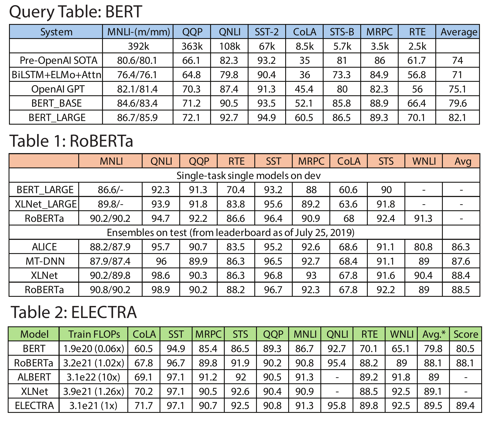
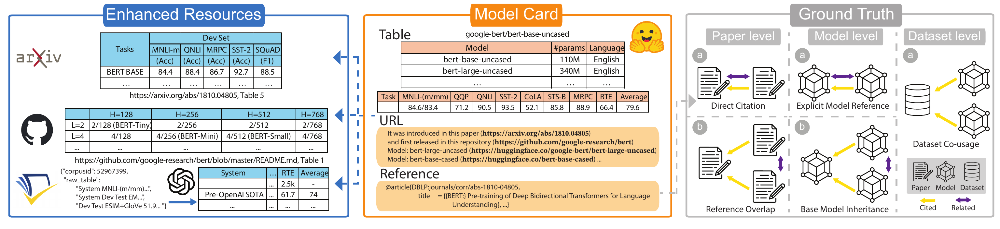

# 📚 ModelTables: A Corpus of Tables about Models

## Motivation


We present ModelTables, a benchmark of tables in Model Lakes that captures the structured semantics of performance and configuration tables often overlooked by text-only retrieval. The corpus is built from Hugging Face model cards, GitHub READMEs, and referenced papers, linking each table to its surrounding model and publication context. Compared with open data–lake tables, model tables are smaller yet exhibit denser inter-table relationships, reflecting tightly coupled model and benchmark evolution. The current release covers over 60K models and 90K tables. To evaluate model and table relatedness, we construct a multi-source ground truth using three complementary signals: (1) paper citation links, (2) explicit model-card links and inheritance, and (3) shared training datasets. We present one extensive empirical use case for the benchmark which is table search. We compare canonical Data Lake search operators (unionable, joinable, keyword) and Information Retrieval baselines (dense, sparse, hybrid retrieval) on this benchmark. Union-based semantic table retrieval attains 54.8% P@1 overall (54.6% on citation, 31.3% on inheritance, 30.6% on shared-dataset signals); table-based dense retrieval reaches 66.5% P@1, and metadata-hybrid retrieval achieves 54.1%. This evaluation indicates clear room for developing better table search methods. By releasing ModelTables and its creation protocol, we provide the first large-scale benchmark of structured data describing AI model. Our use case of table discovery in Model Lakes, provides intuition and evidence for developing more accurate semantic retrieval, structured comparison, and principled organization of structured model knowledge.

## Contents

- [Motivation](#motivation)
- [Example](#example)
- [Overview](#overview)
- [Installation](#installation)
- [QuickInference](#quickinference)
- [Scripts](#scripts)
- [Acknowledgements](#acknowledgements)

## Example



## Overview

Our research on semantic table discovery in Model Lakes consists of three primary sub-tasks. This repository focus on data collection and ground-truth generation for model relatedness. The table discovery methods are developed based on other already published repositories.

### How to get tables and citation graph

We construct multi-level citation graphs (paper, model card, dataset) to infer relationships between models and their associated tables. We extract tabular data from diverse sources via a crawling pipeline that parses tables from Hugging Face model cards, GitHub READMEs, and academic paper HTML.



### How to do table search

Refer to the baselines we mentioned in paper.

Following these workflows, ModelLake enables robust data ingestion, citation graph construction, and semantic table discovery.

-----

## Installation

Install and setup the environment:

```bash
git clone https://github.com/RJMillerLab/ModelTables.git
cd ModelTables/
pip install -r requirements.txt
```

Set environment variables:

Please create a `.env` file in the root directory to store sensitive information such as your OpenAI API key and Semantic Scholar API key. These variables are only needed when running from scratch.

```bash
echo "OPENAI_API_KEY='your_api_key'" > .env # Optional, if necessary
echo "SEMANTIC_SCHOLAR_API_KEY='your_api_key'" > .env # Optional, if necessary
```

## QuickInference

Here we provide steps for quick inference. The script start from scratch will be at the scripts section.

### Downloading data

For double-blind requirement, we will release the dataset after decision.

The crawled tables from different resources are stored at

```bash
data/
└── processed/
    ├── deduped_github_csvs/      # Tables extracted from GitHub READMEs.
    ├── deduped_hugging_csvs/     # Tables extracted from Hugging Face model cards.
    ├── tables_output/            # Tables parsed directly from ArXiv HTML sources.
    └── llm_tables/               # Tables extracted from Semantic Scholar dataset and reformalized by GPT.
```

The groundtruth from different level (paper v.s. model v.s. dataset) are stored at

```bash
data/
└── gt/
    ├── csv_pair_matrix_{direct_label/max_pr}_{influential/methodology_or_result/methodology_or_result_influential/None}.npz # link across tables, paper GT
    ├── scilake_gt_modellink_{dataset/model}_adj.npz # link across tables, dataset/model GT
    ├── csv_list_{direct_label/max_pr}_{influential/methodology_or_result/methodology_or_result_influential/None}.pkl # csv name for above matrix, paper GT
    ├── scilake_gt_modellink_{dataset/model}_adj_csv_list_processed.pkl # csv name for above matrix, dataset/model GT
    ├── csv_pair_union_direct.npz # link across tables, all GT
    ├── csv_pair_union_direct_csv_list.pkl # csv name for above matrix, all GT
```

**Tips:** Unlike traditional table discovery ground-truths (e.g., csv1:[csv2, csv3]), we optimize storage by representing relatedness as binary matrices with corresponding CSV name lists. Each matrix entry indicates if two tables are related by our ground-truth.

### Trained models/vectors/results file for table discovery methods

For double-blind requirement, we will release these files after decision.

The Model/Vectors/Metrics/Results will located at

```bash
<table discovery method repo>/
└── data/
    ├── <benchmark_name>
        ├── datalake # where tables located
        ├── vectors # where encoded table vectors located
├── results/ # where model file and predicted files located
    ├── <benchmark_name>
├── metrics/ # where computed metrics located
```

-----

## Scripts

Refer to scripts [section](docs/scripts.md) for crawling/training from scratch

## Acknowledgements

We would like to thank the following repositories and projects for their invaluable contributions:

* **[megagonlabs/starmie](https://github.com/megagonlabs/starmie)**: Semantic Table Discovery framework and evaluation setup.

* **[Table Union Search Benchmark](https://github.com/RJMillerLab/table-union-search-benchmark/tree/master)**: Benchmark datasets and tasks for table union search.

* **[SANTOS Dataset](https://github.com/northeastern-datalab/santos/tree/main/groundtruth)**: Ground truth data for table discovery evaluations.

* **[LUH-DBS/Blend](https://github.com/LUH-DBS/Blend)**: Unified table discovery system.

* **[castorini/pyserini](https://github.com/castorini/pyserini)**: Python toolkit for reproducible information retrieval research with sparse and dense representations.

* **Hugging Face** for open-source datasets:
    * [librarian-bots/model_cards_with_metadata](https://huggingface.co/datasets/librarian-bots/model_cards_with_metadata)
    * [librarian-bots/dataset_cards_with_metadata](https://huggingface.co/datasets/librarian-bots/dataset_cards_with_metadata)

* **Semantic Scholar** API for their [academic graph and datasets](https://www.semanticscholar.org/product/api/tutorial), essential for building our citation network.
