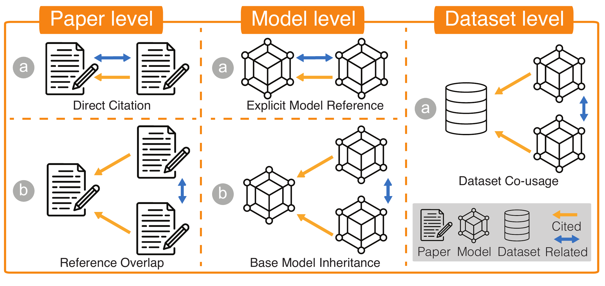

# 📚 Semantic Table Discovery in Model Lakes:  a Benchmark

## Motivation


ModelLake is a benchmark framework that bridges traditional Data Lake table discovery techniques with Model Lake challenges by leveraging citation graphs and semantic table search to enable efficient discovery and comparison of pre-trained machine learning models based on their performance and configuration data.

## Contents
- [Motivation](#motivation)
- [Example](#example)
- [Overview](#overview)
- [Installation](#installation)
- [QuickInference](#quickinference)
- [Scripts](#scripts)
- [Acknowledgements](#acknowledgements)

## Example

In our Model Lake benchmark, we apply a Semantic Unionable Search strategy to retrieve semantically compatible tables from a large table lake given a query table. The retrieved tables are unionable, meaning they share similar schema and semantics and can be meaningfully aligned for comparison.

<table width="100%">
  <colgroup>
    <col width="40%" />
    <col width="60%" />
  </colgroup>
  <tr>
    <td>
      
    </td>
    <td>
      
    </td>
  </tr>
  <tr>
    <td>
      **Example 1 (Performance Tables):** Starting from a query table that reports BERT’s performance on GLUE and SQuAD, the system retrieves other model performance tables such as RoBERTa, BART, ELECTRA, and Uni-Perceive…
    </td>
    <td>
      **Example 2 (Configuration Tables):** Given a configuration table for a specific model (e.g., MicroRWKV), the system retrieves model spec tables like TokenFormer, TiroBERTa, DAT variants, IndoBERT, and Flaubert…
    </td>
  </tr>
</table>

Together, these examples demonstrate that our method retrieves semantically aligned, task-relevant, and unionable tables that support both performance benchmarking and model configuration analysis under shared topics and structures.

## Overview

ModelLake provides a comprehensive framework for collecting, processing, and enabling semantic search over model-related tabular data. Our pipeline leverages diverse sources like Hugging Face Model Cards, GitHub repositories, and academic papers to construct a rich, interconnected benchmark.

### How to get Citation Graph
We construct multi-level citation graphs (paper, model card, dataset) to infer relationships between models and their associated tables.



### How to get Tables
We extract tabular data from diverse sources via a crawling pipeline that parses tables from Hugging Face model cards, GitHub READMEs, and academic paper HTML.


### How to do semantic table union-able search

We select [starmie](https://github.com/megagonlabs/starmie) as our semantic table union-able search technique. We put the refined code we used under `./starmie/` folder.

Following these workflows, ModelLake enables robust data ingestion, citation graph construction, and semantic table discovery.

-----

## Installation

Install and setup the environment:

```bash
git clone https://github.com/DoraDong-2023/ModelLake.git
cd ModelLake/
pip install -r requirements.txt
```

Set environment variables:

Please create a `.env` file in the root directory to store sensitive information such as your OpenAI API key and Semantic Scholar API key. These variables are only needed when running from scratch. 

```bash
echo "OPENAI_API_KEY='your_api_key'" > .env
echo "SEMANTIC_SCHOLAR_API_KEY='your_api_key'" > .env # Optional, use this to download semantic scholar dataset, or faster querying 
```

## QuickInference
### Downloading data 

This project utilizes datasets hosted on Hugging Face and Semantic Scholar. Use the following commands to download our processed data:
```bash
mkdir data
mkdir data/processed
# Downloading processed data
pip install gdown
gdown --folder 1xHbcv01VQ2RG8zmxo0w6y4kRtqxZoAO0 -O data/processed/ # tables
gdown --folder 1UJKEEqKZXYB1v4alGyWo7Ut7Anjub0Kg -O data/gt/ # ground truth
```

The tables from different resources are stored at
```bash
data/
└── processed/
    ├── deduped_github_csvs/      # Tables extracted from GitHub READMEs.
    ├── deduped_hugging_csvs/     # Tables extracted from Hugging Face model cards.
    ├── tables_output/            # Tables parsed directly from ArXiv HTML sources.
    └── llm_tables/               # Tables extracted from Semantic Scholar dataset and reformalized by GPT.
```

The groundtruth from different level are stored at
```bash
data/
└── gt/
    ├── csv_pair_matrix_{direct_label/max_pr}_{influential/methodology_or_result/methodology_or_result_influential/None}.npz # link across tables, paper GT
    ├── scilake_gt_modellink_{dataset/model}_adj.npz # link across tables, dataset/model GT
    ├── csv_list_{direct_label/max_pr}_{influential/methodology_or_result/methodology_or_result_influential/None}.pkl # csv name for above matrix, paper GT
    ├── scilake_gt_modellink_{dataset/model}_adj_csv_list_processed.pkl # csv name for above matrix, dataset/model GT
    ├── csv_pair_union_direct.npz # link across tables, all GT
    ├── csv_pair_union_direct_csv_list.pkl # csv name for above matrix, all GT
```

Or process raw data from scratch
```bash
mkdir data/raw
# Downloading huggingface model card dataset
git lfs install
git clone https://huggingface.co/datasets/librarian-bots/model_cards_with_metadata data/raw/model_cards_with_metadata
git clone https://huggingface.co/datasets/librarian-bots/dataset_cards_with_metadata data/raw/dataset_cards_with_metadata
# Downloading Semantic Scholar data if you need to setup local database
# Alternatively, refer to Semantic Scholar API documentation for bulk data access.

# Check https://drive.google.com/drive/folders/1YLfkknrFuE9pWFJuarb4kyX1o5NtN-Y8?usp=drive_link for intermediate data checkpoints
```

### Demo on Starmie
```bash
cd <starmie_repo_path>
# download files
gdown --folder 1RiadO0E-IARYi_ukT0qaxSyyiK2Xozro -O <starmie_repo_path>/
# run inference scripts
bash scripts/step3_processmetrics.sh # run main scripts for comparing gt and predicted results
bash scripts/step3_processmetrics_<baseline_1,2,3>.sh # run on comparing gt and baseline results
bash eval_per_resource.sh # run results on each resource (Hugging/Github/arXiv/Semantic Scholar)
```

The Model/Vectors/Metrics/Results will located at

```bash
<starmie_repo_path>/
└── data/
    ├── <benchmark_name>
        ├── datalake # where tables located
        ├── vectors # where encoded table vectors located
├── results/ # where model file and predicted files located
    ├── <benchmark_name>
├── metrics/ # where computed metrics located
```

---

## Scripts

Refer to scripts [section](docs/scripts.md) for crawling/training from scratch

