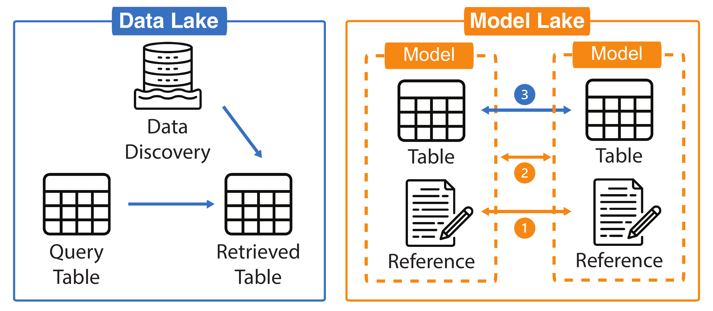
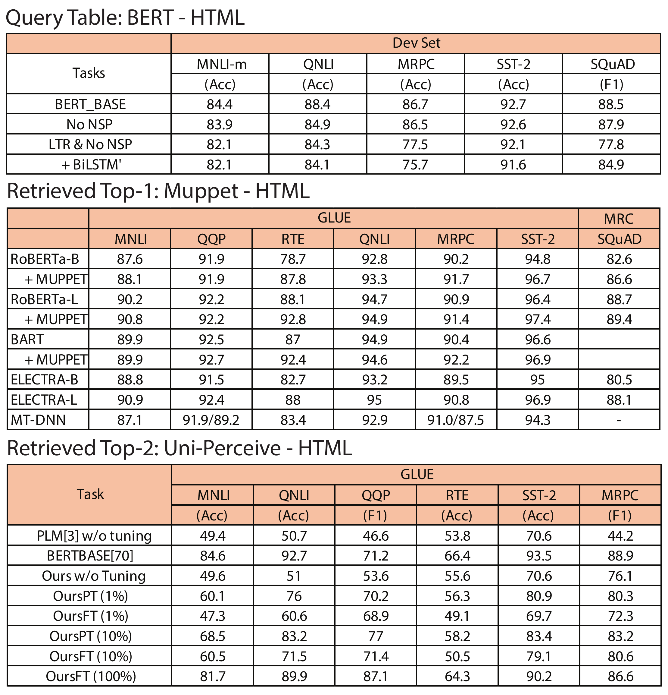
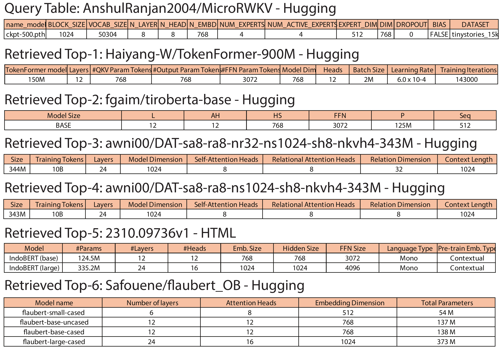
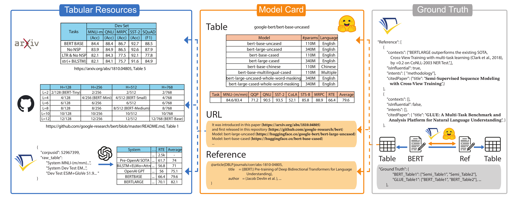

# 📚 Semantic Table Discovery in Model Lakes:  a Benchmark

<p align="center">
  <a href="YOUR_ARXIV_LINK" target="_blank"></a>
  <a href="YOUR_GITHUB_REPO_LINK" target="_blank"></a>
  <a href="YOUR_PROJECT_PAGE_LINK" target="_blank"></a>
  <a href="YOUR_HF_DATASET_LINK" target="_blank"></a>
  <a href="YOUR_HF_DAILY_PAPERS_LINK" target="_blank"></a>
  <a href="YOUR_HF_CHROME_PLUGIN_LINK" target="_blank"></a>
  <a href="YOUR_ARXIV_CHROME_PLUGIN_LINK" target="_blank"></a>
  <a href="YOUR_GITHUB_CHROME_PLUGIN_LINK" target="_blank"></a>
</p>

## Motivation



ModelLake is a benchmark framework that bridges traditional Data Lake table discovery techniques with Model Lake challenges by leveraging citation graphs and semantic table search to enable efficient discovery and comparison of pre-trained machine learning models based on their performance and configuration data.

## Example

In our Model Lake benchmark, we apply a Semantic Unionable Search strategy to retrieve semantically compatible tables from a large table lake given a query table. The retrieved tables are unionable, meaning they share similar schema and semantics and can be meaningfully aligned for comparison.

<table width="100%">
  <colgroup>
    <col width="40%" />
    <col width="60%" />
  </colgroup>
  <tr>
    <td>
      
    </td>
    <td>
      
    </td>
  </tr>
  <tr>
    <td>
      **Example 1 (Performance Tables):** Starting from a query table that reports BERT’s performance on GLUE and SQuAD, the system retrieves other model performance tables such as RoBERTa, BART, ELECTRA, and Uni-Perceive…
    </td>
    <td>
      **Example 2 (Configuration Tables):** Given a configuration table for a specific model (e.g., MicroRWKV), the system retrieves model spec tables like TokenFormer, TiroBERTa, DAT variants, IndoBERT, and Flaubert…
    </td>
  </tr>
</table>

Together, these examples demonstrate that our method retrieves semantically aligned, task-relevant, and unionable tables that support both performance benchmarking and model configuration analysis under shared topics and structures.

## Overview

ModelLake provides a comprehensive framework for collecting, processing, and enabling semantic search over model-related tabular data. Our pipeline leverages diverse sources like Hugging Face Model Cards, GitHub repositories, and academic papers to construct a rich, interconnected benchmark.

The project focuses on:

  * **Robust Data Ingestion:** Extracting performance metrics and configuration settings from heterogeneous sources.
  * **Citation Graph Construction:** Building multi-level citation graphs (paper, model card, dataset) to infer relationships between models and their associated tables.
  * **Semantic Table Discovery:** This repository primarily handles the preparation of data for semantic table discovery and subsequent analysis; the training and inference for the table discovery technique itself are conducted in the offical starmie GitHub repository: [megagonlabs/starmie](https://github.com/megagonlabs/starmie) or a refined version [DoraDong-2023/starmie_internal](https://github.com/DoraDong-2023/starmie_internal)



In our crawling pipeline, we parse tables from different resources and hyperlinks in each model card. Each model card may contain structured data in various locations. We extract these tables and then label table pairs with ground-truth relationships.

## 📋 Table of Contents
- [Motivation](#motivation)
- [Example](#example)
- [Overview](#overview)
- [Installation](#installation)
- [Data](#data)
- [Scripts](#scripts)
- [Acknowledgements](#acknowledgements)
- [Citation](#citation)

-----

## Installation

Install and setup the environment:

```bash
git clone https://github.com/DoraDong-2023/ModelLake.git
cd ModelLake/
pip install -r requirements.txt
```

Set environment variables:

This project uses the `python-dotenv` library to manage environment variables. Please create a `.env` file in the root directory to store sensitive information such as your OpenAI API key and Semantic Scholar API key. These variables will be automatically loaded using `load_dotenv()`.

```bash
echo "OPENAI_API_KEY='your_api_key'" > .env
echo "SEMANTIC_SCHOLAR_API_KEY='your_api_key'" > .env # Optional, use this to download semantic scholar dataset, and faster querying 
```

## Data

This project utilizes datasets hosted on Hugging Face and Semantic Scholar. Use the following commands to download the necessary data:
```bash
mkdir data
mkdir data/processed
# Downloading processed data
pip install gdown
gdown --folder 1xHbcv01VQ2RG8zmxo0w6y4kRtqxZoAO0 -O data/processed/
```
The data format is like
```bash
data/
└── processed/
    ├── deduped_github_csvs/      # Tables extracted from GitHub READMEs.
    ├── deduped_hugging_csvs/     # Tables extracted from Hugging Face model cards.
    ├── tables_output/            # Tables parsed directly from ArXiv HTML sources.
    └── llm_tables/               # Tables extracted from Semantic Scholar dataset and reformalized by GPT.
```

Or process raw data from scratch
```bash
mkdir data/raw
# Downloading huggingface model card dataset
git lfs install
git clone https://huggingface.co/datasets/librarian-bots/model_cards_with_metadata data/raw/model_cards_with_metadata
git clone https://huggingface.co/datasets/librarian-bots/dataset_cards_with_metadata data/raw/dataset_cards_with_metadata
# Downloading Semantic Scholar data if you need to setup local database
# Alternatively, refer to Semantic Scholar API documentation for bulk data access.

# Check https://drive.google.com/drive/folders/1YLfkknrFuE9pWFJuarb4kyX1o5NtN-Y8?usp=drive_link for intermediate data checkpoints
```

---

## Scripts

This section outlines the workflow for processing data, building the ground truth, and running evaluations.

### 1\. Parse Initial Elements

This step extracts key metadata from model cards and associated links.
```bash
# Split readme and tags, parse URLs, parse BibTeX entries.
# Output: ['modelId', 'author', 'last_modified', 'downloads', 'likes', 'library_name', 'tags', 'pipeline_tag', 'createdAt', 'card', 'card_tags', 'card_readme', 'pdf_link', 'github_link', 'all_links', 'extracted_bibtex', 'extracted_bibtex_tuple', 'parsed_bibtex_tuple_list', 'successful_parse_count']
python -m src.data_preprocess.step1

# Download GitHub READMEs and HTMLs from extracted URLs.
# Input: modelcard_step1.parquet
# Output: giturl_info.parquet, downloaded_github_readmes/
python -m src.data_preprocess.step1_down_giturl
#python -m src.data_preprocess.step1_down_giturl_fake # if program has leakage but finished downloading, then re-run this code to save final parquet and cache files.
find data/downloaded_github_readmes -type f -exec stat -f "%z %N" {} + | sort -nr | head -n 50 | awk '{printf "%.2f MB %s\n", $1/1024/1024, $2}' # some readme files are too large, we fix this issue

# Query specific GitHub URL content (example)
# Input: local path to a downloaded README
# Output: URL content
python -m src.data_preprocess.step1_query_giturl load --query data/downloaded_github_readmes/7166b2cb378b3740c3b212bc0657dd11.md
```

### 2\. Download and Build Database for Faster Querying

This step sets up local databases for efficient querying of Semantic Scholar data.

```bash
# TODO: add command from privatecommonscript to here, for downloading the semantic scholar here
# Requirement: cd to the path of downloaded dataset, e.g.: cd ~/shared_data/se_s2orc_250218
python -m src.data_localindexing.build_mini_s2orc build --directory /u4/z6dong/shared_data/se_s2orc_250218/ # After downloading semantic scholar dataset, build database based on it.
python -m src.data_localindexing.build_mini_s2orc query --title "BioMANIA: Simplifying bioinformatics data analysis through conversation" --directory /u4/z6dong/shared_data/se_s2orc_250218/ # After building up database, query title based on db file.
python -m src.data_localindexing.build_mini_s2orc query_cid --corpusid 248779963 --directory /u4/z6dong/shared_data/se_s2orc_250218

# issue: citation edge is hard to store, it is too much ... Solution: I think we better using the API to query citation relationship? Or use cypher to query over graph condensely
# python -m src.data_localindexing.build_complete_citation build --directory ./ # build db for citation dataset
# python -m src.data_localindexing.build_complete_citation query --citationid 169 --directory ./
# (Optional) if you don't have key, use public API for querying citations instead
# python -m src.data_preprocess.step1_citationAPI # get citations through bibtex only by API. TODO: Update for bibtex + url, not bibtex only. TODO: Update for all bibtex, not the first bibtex

# Optional solution: we use kuzu database to store node and edge
#python -m src.data_localindexing.build_mini_citation_kuzu --mode build --directory /u4/z6dong/shared_data/se_citations_250218/
#python -m src.data_localindexing.test_node_edge_db # test how many nodes and edges are in built database
# issue: slow for our 300G ndjson files, not suitable for this stage

# Optional solution: we use neo4j database to store and query
#python src.data_localindexing.build_mini_citation_neo4j --mode build --directory ./ --fields minimal
#python src.data_localindexing.build_mini_citation_neo4j --mode query --citationid 248811336
# for slurm run this script to keep neo4j open in another terminal
# sbatch src.data_localindexing.neo4j_slurm

# fuzzy matching: elastic search for s2orc
python -m src.data_localindexing.build_mini_s2orc_es --mode build --directory /u4/z6dong/shared_data/se_s2orc_250218 --index_name papers_index --db_file /u4/z6dong/shared_data/se_s2orc_250218/paper_index_mini.db
python -m src.data_localindexing.build_mini_s2orc_es --mode query --directory /u4/z6dong/shared_data/se_s2orc_250218 --index_name papers_index --query "BioMANIA: Simplifying bioinformatics data analysis through conversation"
python -m src.data_localindexing.build_mini_s2orc_es --mode test --directory /u4/z6dong/shared_data/se_s2orc_250218 --index_name papers_index --db_file /u4/z6dong/shared_data/se_s2orc_250218/paper_index_mini.db
# batch querying papers_index
python build_mini_s2orc_es.py --mode batch_query --directory /u4/z6dong/shared_data/se_s2orc_250218 --index_name papers_index --titles_file data/processed/modelcard_dedup_titles.json --cache_file data/processed/query_cache.json
# getting full tables
```

### 3\. Extract Tables to Local Folder

This step extracts tabular data from various sources and processes it.
```bash
# Extract tables from GitHub READMEs and Model Cards. Saves CSVs to local folder.
# Input: data/processed/modelcard_step1.parquet, github_readmes_info.parquet, downloaded_github_readmes/
# Output: modelcard_step2.parquet, deduped_hugging_csvs/, hugging_deduped_mapping.json, deduped_github_csvs/, md_to_csv_mapping.json
python -m src.data_preprocess.step2_gitcard_tab

# Process downloaded GitHub HTML files to Markdown.
# Input: data/downloaded_github_readmes/
# Output: data/downloaded_github_readmes_processed/
python -m src.data_preprocess.step2_md2text

# Fetch titles from BibTeX entries and PDF URLs using Semantic Scholar.
# Input: modelcard_step1.parquet, github_readme_cache.parquet, github_readmes_processed/, PDF/GitHub URLs
# Output: modelcard_all_title_list.parquet, github_readme_cache_update.parquet, github_extraction_cache.json, all_links_with_category.csv
python -m src.data_preprocess.step2_se_url_title

# Save deduplicated titles for querying Semantic Scholar.
# Input: modelcard_all_title_list.parquet
# Output: modelcard_dedup_titles.json, modelcard_title_query_results.json, modelcard_all_title_list_mapped.parquet
python -m src.data_preprocess.step2_se_url_save

#### Option1:
# Query Semantic Scholar API for citation information (alternative to local database if no key, but may hit rate limits).
# Input: modelcard_dedup_titles.json
# Output: s2orc_query_results.parquet, s2orc_citations_cache.parquet, s2orc_references_cache.parquet, s2orc_titles2ids.parquet
python -m src.data_preprocess.s2orc_API_query > logs/s2orc_API_query_v3_429.log
 - python -m src.data_preprocess.s2orc_log_429 # incase some title meet 429 error (API rate error)
 - python -m src.data_preprocess.s2orc_retry_missing # make up for the missing items
 - python -m src.data_preprocess.s2orc_merge # parse the references and citations from retrieved results | I: s2orc*.parquet, O: s2orc_rerun.parquet

 - bash src/data_localindexing/build_mini_citation_es.sh # I: xx | O: batch_results

# (Deprecate: Old method) bash src/data_localindexing/build_mini_citation_es.sh
# Extract full records from batch query results.
# Input: batch_results + hit_ids.txt
# Output: full_hits.jsonl
python -m src.data_localindexing.extract_full_records

# Merge extracted full records.
# Input: full_hits.jsonl
# Output: s2orc_citations_cache, s2orc_references_cache, s2orc_query_results
python -m src.data_localindexing.extract_full_records_to_merge

 - python -m src.data_preprocess.s2orc_merge # I: s2orc*.parquet, O: s2orc_rerun.parquet

 # (deprecate) - bash src/data_localindexing/build_mini_s2orc_es.sh # choose dump data to setup and batch query |
  # I: paper_index_mini.db, modelcard_dedup_titles.json → O: Elasticsearch index (e.g., papers_index), query_cache.parquet
 - bash src/data_preprocess/step2_se_url_tab.sh # extract fulltext -> ref/cit info
# I: query_cache.parquet/s2orc_rerun.parquet, paper_index_mini.db, NDJSON files in /se_s2orc_250218 → O: extracted_annotations.parquet, merged_df.parquet


# Download HTML content for table extraction.
# Input: extracted_annotations.parquet, arxiv_titles_cache.json
# Output: title2arxiv_new_cache.json, arxiv_html_cache.json, missing_titles_tmp.txt, arxiv_fulltext_html/*.html
python -m src.data_preprocess.step2_get_html

# Extract tables from HTML files.
# Input: arxiv_html_cache.json, arxiv_fulltext_html/*.html, html_table.parquet (optional)
# Output: html_table.parquet, tables_output/*.csv
python -m src.data_preprocess.step2_html_parsing

mkdir logs
# Integrate all processed table data (HTML, potentially LLM-polished text).
# Input: title2arxiv_new_cache.json, html_table.parquet, extracted_annotations.parquet, pdf_download_cache.json
# Output: before_llm_output.parquet, batch_input.jsonl, batch_output.jsonl, llm_markdown_table_results.parquet
python -m src.data_preprocess.step2_integration_order > logs/step2_integration_order_0508.log
# Check OpenAI batch job status (if using LLM for table processing)
bash src/data_preprocess/openai_batchjob_status.sh

# (Optional) If the sequence is wrong, reproduce from the log...
#python -m src.data_preprocess.quick_repro
#cp -r llm_outputs/llm_markdown_table_results_aligned.parquet llm_outputs/llm_markdown_table_results.parquet

# Save LLM-processed tables into local CSVs.
# Input: llm_markdown_table_results.parquet
# Output: llm_tables/*.csv, final_integration_with_paths.parquet
python -m src.data_preprocess.step2_llm_save > logs/step2_llm_save_0508.log
```

### 4\. Label Ground Truth for Unionable Search Baselines


This section details the process of generating ground truth labels for table unionability.
```bash
# Merge all table lists into a unified model ID file.
# Input: final_integration_with_paths.parquet, modelcard_all_title_list.parquet
# Output: modelcard_step3_merged.parquet
python -m src.data_gt.step3_pre_merge

# (Only need if we not run s2orc_API_query) python -m src.data_gt.step3_API_query # paper level: get citations relation by API | Tips: notify the timing issue, this is the updated real-time query, your local corpus data might be outdated
# I: final_integration_with_paths.parquet. O: modelcard_citation_enriched.parquet

# Compute paper-pair overlap scores for citation analysis.
# Input: extracted_annotations/modelcard_citation_enriched
# Output: modelcard_rate/label.pickle
python -m src.data_gt.overlap_rate

# Plot violin figures of overlap rates.
python -m src.data_gt.overlap_fig

# Determine overlap thresholds.
python -m src.data_gt.overlap
```

### Quality Control \!\!\! | Run some analysis

Ensure data quality and consistency before generating final ground truth.

```bash
# This must be run before ground truth generation.
# Deduplicate raw tables, prioritizing Hugging Face > GitHub > HTML > LLM.
# Input: modelcard_step3_merged
# Output: modelcard_step3_dedup
python -m src.data_analysis.qc_dedup > logs/qc_dedup_0516.log

# Generate figures for deduplication analysis.
python -m src.data_analysis.qc_dedup_fig

# Generate statistics on the processed dataset.
# Input: modelcard_step4_dedup (ensure this is updated after deduplication)
# Output: benchmark_results
python -m src.data_analysis.qc_stats > logs/qc_stats_0516.log

# Generate figures for dataset statistics.
python -m src.data_analysis.qc_stats_fig

# (Optional) Double-check deduplication and mapping logic.
# python -m src.data_analysis.qc_dc

# Obtain file counts directly from folders to verify against statistics.
bash src/data_analysis/count_files.sh
```

### Final Ground Truth Generation

Generate the definitive ground truth files for evaluation.

```bash
# Create symbolic links for organizing processed tables on different devices.
# Input: modelcard_step3_dedup
# Output: modelcard_step4 + sym_*_csvs_* (symbolic links to processed CSVs)
python -m src.data_gt.step3_create_symlinks

# Build ground truth (paper-level, model-level, dataset-level).
bash src/data_gt/step3_gt.sh

# Debug NPZ ground truth files to ensure valid conditions.
python -m src.data_gt.debug_npz --gt-dir data/gt/

# Process SQLite ground truth into pickle files (if applicable from other benchmarks).
python -m src.data_localindexing.turn_tus_into_pickle
# (deprecate) python -m src.data_gt.gt_combine

# Add other two levels of citation graphs (modelcard and dataset).
python -m src.data_gt.modelcard_matrix

# Plot GT length distribution (boxplot/violin).
python -m src.data_analysis.gt_distri

# Compute non-zero edge statistics for citation graphs.
python -m src.data_gt.nonzeroedge

# (test)python -m src.data_gt.test_modelcard_update --mode dataset # check whether matrix multiplication and for loop obtain the same results
#(test)python -m src.data_gt.convert_adj_to_npz --input data/gt/scilake_gt_modellink_dataset_adj_processed.pkl --output-prefix data/gt/scilake_gt_modellink_dataset # pkl2npz

# Merge union ground truth.
python -m src.data_gt.merge_union --level direct

# Update CSV lists for various ground truth variants.
python -m src.data_gt.create_csvlist_variants --level direct
# (depreate) python -m src.data_gt.create_gt_variants data/gt/csv_pair_adj_overlap_rate_processed.pkl # produce _s, _t, _s_t for pkl files
# (deprecate) python -m src.data_gt.print_relations_stats data/tmp/relations_all.pkl # print stats for matrix
# (deprecate) python -m src.data_analysis.gt_fig # plot stats
```

### 5\. Create Symlinks for Starmie Integration

Prepare data and augmentations for integration with the Starmie benchmark framework.

```bash
# go to starmie folder, and copy this sh file to run 
python -m src.data_symlink.trick_aug --repo_root /u1/z6dong/Repo --mode str # trick: header-str(value)
python -m src.data_symlink.trick_aug --repo_root /u1/z6dong/Repo --mode transpose # trick: permutation
python -m src.data_symlink.trick_aug --repo_root /u1/z6dong/Repo --mode str_transpose # trick: tr + str 

python -m src.data_symlink.ln_scilake --repo_root /u1/z6dong/Repo --mode str
python -m src.data_symlink.ln_scilake --repo_root /u1/z6dong/Repo --mode tr
python -m src.data_symlink.ln_scilake --repo_root /u1/z6dong/Repo --mode tr_str
python -m src.data_symlink.ln_scilake --repo_root /u1/z6dong/Repo --mode base # symlink csvs to the target folder
# bash src/data_analysis/count_files.sh check whether the symlink path include some files
```

### 6\. Run Updated Starmie Scripts

Execute Starmie's pipeline for contrastive learning, embedding extraction, and search

```bash
# Sample 1000 tables from each resource folder for evaluation.
# bash prepare_sample.sh
# Alternative for server:
# python -m src.data_symlink.prepare_sample_server --root_dir /u4/z6dong/Repo --output scilake_final --output_file scilake_final_filelist.txt --limit 2000 --seed 42
# Another substitution:
python -m src.data_symlink.prepare_sample --root_dir /u1/z6dong/Repo --output_file scilake_final_filelist.txt --limit 1000 --seed 42


# Create file lists for trick-augmented files.
# Input: scilake_final_filelist.txt
# Output: scilake_final_filelist_{tricks}_filelist.txt
# python -m src.data_symlink.prepare_sample_tricks --input_file scilake_final_filelist.txt

# Create validation file lists.
python -m src.data_symlink.ln_scilake_final_link --filelist scilake_final_filelist.txt scilake_final_filelist_val.txt

# (deprecate) (already processed in QC step) bash check_empty.sh # filter out empty files (or low quality files later)
# Fine-tune contrastive learning model.
bash scripts/step1_pretrain.sh

# Encode embeddings for query and datalake items.
bash scripts/step2_extractvectors.sh

# Perform data lake search (retrieval).
bash scripts/step3_search_hnsw.sh

# Extract metrics based on ground truth and retrieval results; plot figures.
bash scripts/step3_processmetrics.sh

# Run ablation study on different resources (after getting results).
bash eval_per_resource.sh
# (Alternatively, run before getting results) bash eval_per_resource.sh

# (Optional) bash scripts/step4_discovery.sh
```


### 7\. Baseline Evaluation

Run baseline table embedding and retrieval methods for comparison.

```bash
# build corpus jsonl/encode(SBERT)/build faiss/search/postprocess
bash src/baseline_1/table_retrieval_pipeline.sh
# compute metrics under starmie
bash scripts/step3_processmetrics_baseline.sh # run baseline metrics computation
```
for faiss cpu/gpu installation, see [FAISS GitHub repository](https://github.com/facebookresearch/faiss).

____
8. Baseline2: Sparse search
```bash
# 1. generate mapping from csv_path:readme_path
python src/baseline2/create_raw_csv_to_text_mapping.py
python src/baseline2/view_mapping.py
# 2. get incontext embedding for each csv_path, save to data/tmp/corpus/collection.jsonl
python src/baseline2/create_dedup_table_to_text_mapping.py
# 3. build index: sparse retrieval by pyserini
python -m pyserini.index.lucene --collection JsonCollection --input data/tmp/corpus --index data/tmp/index --generator DefaultLuceneDocumentGenerator --threads 1 --storePositions --storeDocvectors --storeRaw
# 4. build up tsv
python src/baseline2/create_queries_from_table.py
# or python src/baseline2/create_queries_from_corpus.py
# 4. search pyserini
#python -m pyserini.search.lucene --index data/tmp/index --topics data/tmp/queries_table.tsv --output data/tmp/search_result.txt --bm25 --hits 11 --threads 8 --batch-size 64 # as this can not solve truncating clause automatically
# or python batch_search.py
python src/baseline2/search_with_pyserini.py --hits 11
python src/baseline2/postprocess.py \
  --input  data/tmp/search_result.json \
  --output data/tmp/baseline2_sparse_results.json \
  --top1-list data/tmp/queries_with_top1_matches.txt
```

9. Baseline3: Hybrid (Sparse + Dense search)
```bash
# hybrid search
# python src/baseline_1/table_retrieval_pipeline.py \
# encode --jsonl data/tmp/corpus/collection.jsonl \
#         --model_name all-MiniLM-L6-v2 \
#         --batch_size 256 \
#         --output_npz data/tmp/index_dense/valid_tables_embeddings.npz \
#         --device cpu

# python -m pyserini.encode \
#   input   --corpus   data/tmp/corpus/collection_text.jsonl \
#           --fields   text \
#   output  --embeddings data/tmp/index_dense \
#           --to-faiss \
#   encoder --encoder sentence-transformers/all-MiniLM-L6-v2 \
#           --batch 64 --device cpu
# python src/baseline_1/table_retrieval_pipeline.py \
# build_faiss \
#   --emb_npz     data/tmp/index_dense/valid_tables_embeddings.npz \
#   --output_index data/tmp/index_dense/index.faiss
# #python -m pyserini.search.lucene --index data/tmp/index --topics data/tmp/queries_table.tsv --output data/tmp/search_result_hybrid.txt --bm25 --hits 101 --threads 8 --batch-size 64
# python src/baseline2/search_with_pyserini_hybrid.py \
#   --sparse-index data/tmp/index \
#   --dense-index  data/tmp/index_dense \
#   --queries      data/tmp/queries_table.tsv \
#   --mapping      data/tmp/queries_table_mapping.json \
#   --k 11 --alpha 0.45 --device cpu

# first sparse, then dense
python src/baseline2/search_with_pyserini.py --hits 101 --output data/tmp/search_sparse_101.json
python src/baseline2/filter_sparse_to_dense.py data/tmp/search_sparse_101.json data/tmp/sparse_top101.tsv
# get subset jsonl
# python - <<'PY'
# import json, pathlib, sys
# subset = set(line.strip().split('\t')[1] for line in open(
#     'data/tmp/sparse_top101.tsv'))
# out   = pathlib.Path('data/tmp/corpus/subset.jsonl').open('w')
# for l in open('data/tmp/corpus/collection_text.jsonl'):
#     j = json.loads(l)
#     if j['id'] in subset:
#         out.write(l)
# PY
# add content keyword
#python scripts/make_subset_jsonl.py data/tmp/sparse_top101.tsv data/tmp/corpus/collection_text.jsonl data/tmp/corpus/subset.jsonl
# 2-a  Encode
python src/baseline_1/table_retrieval_pipeline.py \
encode \
    --jsonl data/tmp/corpus/collection.jsonl \
    --model_name sentence-transformers/all-MiniLM-L6-v2 \
    --batch_size 256 \
    --output_npz data/tmp/index_dense/embeddings.npz \
    --device cuda 

# 2-b  Build Faiss index
#python src/baseline_1/table_retrieval_pipeline.py build_faiss --emb_npz data/tmp/index_dense_subset/embeddings.npz --output_index data/tmp/index_dense_subset/index.faiss
# 2-c  Dense search (top-11 per query)
#python dense_rerank.py
python src/baseline2/hybrid_rerank.py \
     --sparse-json data/tmp/search_sparse_101.json \
     --dense-npz   data/tmp/index_dense/embeddings.npz \
     --corpus-jsonl data/tmp/corpus/collection.jsonl \
     --topk 11 --device cuda \
     --output data/tmp/search_result_hybrid.json

python src/baseline2/postprocess.py \
  --input  data/tmp/search_result_hybrid.json \
  --output data/tmp/baseline3_hybrid.json \
  --top1-list data/tmp/hybrid_selfhit_qids.txt

# check whether hybrid result is included in sparse 101 results
python src/baseline2/check_hybrid_vs_sparse.py \
  --hybrid   data/tmp/baseline3_hybrid.json \
  --sparse   data/tmp/search_sparse_101.json
#python src/baseline_1/table_retrieval_pipeline.py search_faiss --faiss_index data/tmp/index_dense_subset/index.faiss --query_tsv   data/tmp/sparse_top101.tsv --topk 11 --output data/tmp/search_dense_11.json
```

### Analysis on Results

Tools for analyzing the retrieval results and ground truth.

```bash
# Get top-10 results from step3_search_hnsw.
python -m src.data_analysis.report_generation --json_path ~/Repo/starmie_internal/tmp/test_hnsw_search_scilake_large_full.json

# Check if a specific CSV pair is related in the ground truth.
python -m src.data_gt.check_pair_in_gt --gt-dir data/gt --csv1 0ab2d85d37_table1.csv --csv2 096d51652d_table1.csv

# Count unique CSVs in retrieval results.
python count_unique_csvs.py --results /u1/z6dong/Repo/starmie_internal/results/scilake_final/test_hnsw_search_drop_cell_tfidf_entity_full.json --gt /u1/z6dong/Repo/ModelLake/data/gt/csv_pair_adj_overlap_rate_processed.pkl

# Check related models for a given CSV.
python -m src.data_analysis.check_related --csv 201646309_table4.csv > logs/check_related_csv.log
```

### Additional Statistics Analysis

Scripts for generating further insights into the dataset.

```bash
python -m src.data_preprocess.step1_analysis # get analysis on proportion of different links
python -m src.data_analysis.query_compare_API_local # compare the query results among local and API from s2orc
TODO: add statistics analysis from dataset_processed.ipynb
```

(Deprecated scripts: Previously we download pdfs and try to parse them. However, we find semantic scholar dataset includes it.)
```bash
# deprecated as we don't use PDF for extraction at this time
#python -m src.data_preprocess.step2_get_pdf #TODO: wait se_url_tab and then test
python -m src.data_preprocess.step_down_pdf
python -m src.data_preprocess.step_add_pdftab # Issue: deterministic PDF2table is not accurate enough. Try LLM based image extraction (not implemented here)
python -m src.data_preprocess.step_down_tex # Issue: IP rate limit on accessing tex files, Possible solution: use arxiv bulk downloading
python -m src.data_preprocess.step_add_textab
python -m src.data_preprocess.step_add_gittab
python -m src.data_ingestion.tmp_extract_url # Update PDF url from extracted url (some don't have .pdf, need to extract from html or add)
python -m src.data_ingestion.tmp_extract_table # Extract table/figures caption and cited text from s2orc dumped data, but don't contain text and figure detailed content!
python -m src.data_preprocess.step4 # process groundtruth (work for API, not work for dump data)
python -m src.data_preprocess.step2_Citation_Info
# (Optional) python -m src.data_preprocess.step3_statistic_table # get statistic tables
python -m src.data_preprocess.step1_parsetags # Parse tags into columns with name start with `card_tag_xx`
bash src/data_symlink/trick_str.sh # too slow
bash src/data_symlink/trick_tr.sh # too slow
bash src/data_symlink/trick_tr_str.sh # too slow
bash src/data_symlink/ln_scilake_large.sh # too slow
bash src/data_symlink/ln_scilake_final.sh
```


## Acknowledgements

We would like to thank the following repositories and projects for their invaluable contributions and inspiration:

* **[megagonlabs/starmie](https://github.com/megagonlabs/starmie)**: For the original Semantic Table Discovery framework and evaluation setup that formed a basis for our work.

* **[Table Union Search Benchmark](https://github.com/RJMillerLab/table-union-search-benchmark/tree/master)**: For providing benchmark datasets and tasks related to table union search.

* **[SANTOS Dataset](https://github.com/northeastern-datalab/santos/tree/main/groundtruth)**: For the ground truth data used in table discovery evaluations.

* The **Hugging Face** team and community for providing open-source access to crucial datasets, including:
    * [librarian-bots/model_cards_with_metadata](https://huggingface.co/datasets/librarian-bots/model_cards_with_metadata)
    * [librarian-bots/dataset_cards_with_metadata](https://huggingface.co/datasets/librarian-bots/dataset_cards_with_metadata)

* The **Semantic Scholar** API for their comprehensive [academic graph and datasets](https://www.semanticscholar.org/product/api/tutorial), which were essential for building our citation network.

## Citations

If you find this repository useful in your research or work, please consider star this repository and citing it:
```bibtex
{}
```